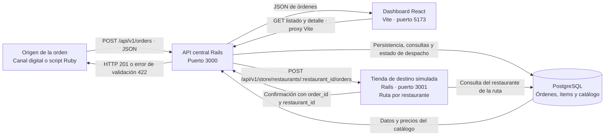
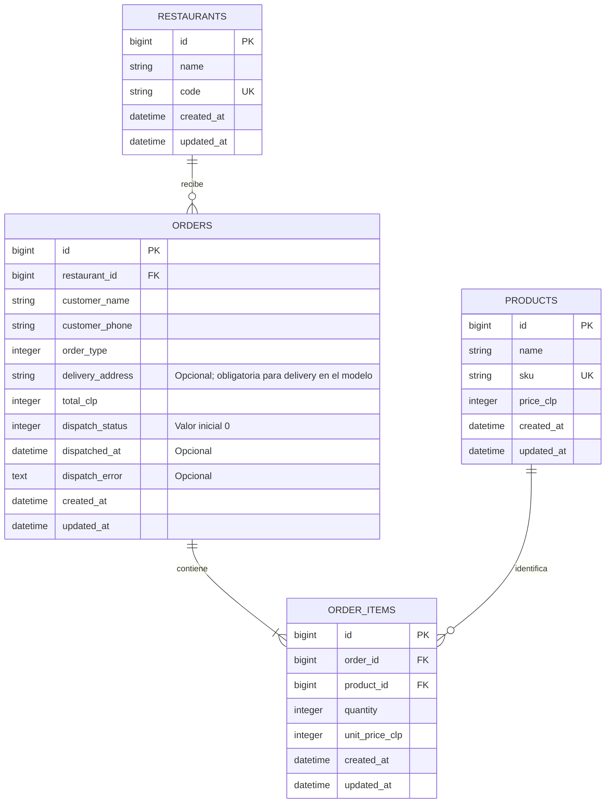

# Arquitectura y modelo de datos

La solución centraliza las órdenes en Rails y PostgreSQL. El script Ruby representa
un origen de pedidos; el dashboard consulta la misma API. Un segundo proceso Rails
simula la recepción de la tienda correspondiente.

Los diagramas están escritos en Mermaid y se pueden visualizar en GitHub o en una
vista previa de Markdown compatible con Mermaid.

## Diagrama de conexión

La API central y el receptor usan el mismo repositorio y la misma base de desarrollo.
Son procesos diferentes para permitir una llamada HTTP entre ambos. El receptor
consulta el restaurante para comprobar la ruta, su ID y su código; no guarda
una copia adicional de la orden. Los locales se representan por rutas distintas,
no por tres servidores independientes.

El destino se obtiene de `Order.restaurant_id`. `STORE_BASE_URL` configura el host
del receptor y `OrderDispatcher` construye la ruta específica del restaurante.
El despacho ocurre dentro de la solicitud de creación, después de persistir la
orden. No hay workers ni colas de despacho en este flujo.

## Diagrama de base de datos

El diagrama refleja [db/schema.rb](../db/schema.rb). Las claves foráneas y sus
índices están definidos en PostgreSQL. `restaurants.code` y `products.sku` tienen
índices únicos. Los campos son `NOT NULL`, salvo dirección de entrega, fecha de
despacho y descripción del error.

Cada orden pertenece a un restaurante y el modelo exige al menos un ítem.
Cada ítem pertenece a una orden y a un producto. Un restaurante o producto puede
existir sin órdenes asociadas. No hay una tabla de clientes: nombre y teléfono
se guardan como datos del pedido.

Los montos son enteros en CLP. `products.price_clp` representa el precio del
catálogo y `order_items.unit_price_clp` conserva el precio utilizado al crear la
orden. El subtotal se obtiene como `quantity × unit_price_clp`; no se guarda en
una columna separada. `orders.total_clp` guarda la suma de los subtotales.

### Valores de los enums

| Campo | Valor en PostgreSQL | Valor en la API | Significado |
| --- | --- | --- | --- |
| `order_type` | 0 | `pickup` | Retiro en restaurante |
| `order_type` | 1 | `delivery` | Entrega a domicilio |
| `dispatch_status` | 0 | `pending` | Estado inicial, antes de confirmar el despacho |
| `dispatch_status` | 1 | `sent` | Recepción confirmada por la tienda de destino |
| `dispatch_status` | 2 | `error` | Falló el envío o la confirmación |

## Flujo completo de una orden

1. **Recepción:** el origen envía `POST /api/v1/orders` con restaurante, modalidad,
   cliente y productos con cantidades. Para delivery incluye dirección.
2. **Parámetros y cálculo:** `OrdersController` aplica strong params, asigna el
   cliente y construye los ítems. `Order#calculate_order_total` obtiene los precios
   del catálogo y calcula el total; no acepta precios ni totales del cliente.
3. **Validación:** los modelos comprueban asociaciones, nombre, teléfono, modalidad,
   presencia de ítems, cantidades enteras positivas y montos positivos. Delivery
   requiere dirección. Los errores de validación devuelven HTTP 422 y no guardan
   la orden ni sus ítems.
4. **Persistencia:** Active Record guarda la orden y sus ítems mediante la misma
   transacción de guardado. El estado inicial del despacho es `pending`.
5. **Despacho:** después del guardado, `OrderDispatcher` construye el payload con
   los datos y precios guardados y lo envía a la ruta del restaurante. La conexión
   tiene un timeout de apertura de 2 segundos y de lectura de 5 segundos.
6. **Confirmación:** la tienda simulada responde HTTP 201 con `status: "received"`,
   `order_id` y `restaurant_id`. La API exige una respuesta HTTP exitosa y que los
   tres valores coincidan. Entonces actualiza el estado a `sent`, registra
   `dispatched_at` y limpia `dispatch_error`.
7. **Fallos:** una respuesta no exitosa, confirmación incorrecta, JSON inválido o
   los errores de conexión contemplados por el dispatcher registran `error` y una
   descripción en `dispatch_error`. La orden permanece guardada.
8. **Respuesta:** una orden guardada devuelve HTTP 201 con su ID y el resultado del
   despacho, tanto si quedó `sent` como si quedó `error`. El HTTP 201 confirma la
   creación de la orden; el estado de despacho informa el resultado del envío.
9. **Consulta:** React solicita el listado paginado, ordenado por `created_at` e ID
   descendentes. Al seleccionar una orden consulta su detalle, incluyendo cliente,
   productos, cantidades y precios guardados. Estas consultas no despachan pedidos.

## Responsabilidades

| Componente | Responsabilidad |
| --- | --- |
| `Api::V1::OrdersController` | Crear, listar y consultar órdenes; parámetros y respuestas HTTP |
| `Order` / `OrderItem` | Relaciones, validaciones y cálculo de montos |
| `Restaurant` / `Product` | Catálogo de destinos y productos |
| Serializers de dashboard y detalle | Formatos JSON de consulta |
| `OrderDispatchSerializer` | Payload enviado a la tienda |
| `OrderDispatcher` | HTTP al destino, validación de confirmación y estado del despacho |
| Controlador de tienda | Validación del destino y confirmación simulada |
| `script/simulate_orders.rb` | Generar escenarios válidos e inválidos y mostrar respuestas |
| Frontend React | Listado, paginación, detalle y estados de carga/error |

## Límites de esta implementación

El despacho síncrono facilita ejecutar y revisar la prueba sin un servicio de colas.
Su duración afecta el tiempo de respuesta del endpoint de creación. No hay
reintentos automáticos ni un endpoint para reenviar pedidos fallidos. Una interrupción
del proceso después del guardado puede dejar una orden `pending`.

El receptor confirma el destino, pero no mantiene un registro propio ni deduplica
recepciones. Si una tienda recibe el pedido y su confirmación se pierde, el sistema
puede registrar `error` aunque la tienda lo haya recibido. Un despacho asíncrono con
reintentos requeriría definir también la idempotencia en la recepción.

El precio unitario conserva el monto original; el nombre y SKU del producto se
consultan desde el catálogo actual. La API no implementa autenticación y el flujo
documentado corresponde a la ejecución local de la prueba.

El dashboard consulta datos mediante HTTP y no recibe eventos en tiempo real.
La paginación por offset puede cambiar si ingresan órdenes mientras se recorre el
listado; combinar por ID evita duplicados, pero no crea una instantánea de los datos.
